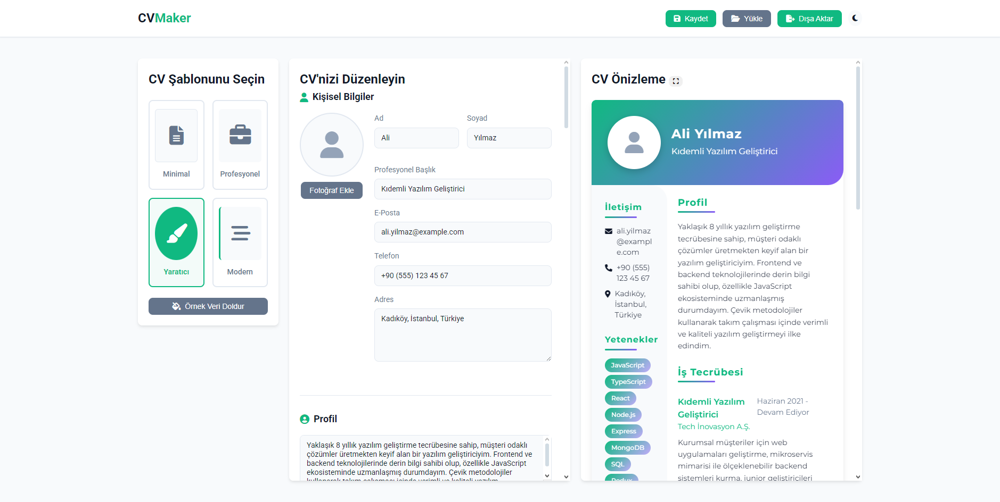

# Modern CV Maker - Profesyonel Özgeçmiş Oluşturucu

Modern CV Maker, kullanıcıların kolayca profesyonel özgeçmişler oluşturabilmelerini sağlayan interaktif bir web uygulamasıdır. Tamamen tarayıcı tabanlı olan bu uygulama, sunucu tarafında herhangi bir işlem gerektirmez ve tamamen JavaScript, HTML ve CSS ile geliştirilmiştir.



## 🚀 Özellikler

- **Şık ve Responsive Tasarım**: Her cihazda sorunsuz çalışan modern kullanıcı arayüzü
- **Çoklu Şablon**: Minimal, Profesyonel, Yaratıcı ve Modern gibi farklı şablonlar
- **Gerçek Zamanlı Önizleme**: Yapılan değişiklikleri anında görüntüleme
- **Çalışma Tecrübesi ve Eğitim Bölümleri**: Sınırsız sayıda iş tecrübesi ve eğitim bilgisi ekleme
- **Yetenek ve Dil Becerileri**: Yeteneklerinizi ve dil yetkinliklerinizi gösterme
- **Sosyal Profil Entegrasyonu**: LinkedIn, GitHub ve kişisel web sitesi bağlantıları
- **QR Kod Entegrasyonu**: LinkedIn, web sitesi veya iletişim bilgileriniz için QR kod oluşturma
- **Dışa Aktarma**: PDF veya PNG formatında dışa aktarma seçenekleri
- **Kaydetme ve Yükleme**: Tarayıcı tarafı veri saklama ile özgeçmişlerinizi kaydetme ve yükleme
- **Aydınlık/Karanlık Tema**: Göz yormayan arayüz seçenekleri
- **Renk Şeması Özelleştirme**: Kişisel zevke göre renk teması değiştirme

## 🛠️ Teknolojiler

- **HTML5** - Sayfanın yapısı için
- **CSS3** - Stillendirme ve görsel tasarım için
- **JavaScript (ES6+)** - Uygulama mantığı ve etkileşimler için
- **Local Storage API** - Tarayıcı tarafında veri saklama için
- **jsPDF & html2canvas** - PDF ve resim dışa aktarma için
- **QRCode.js** - QR kod oluşturma için
- **Font Awesome** - İkonlar için

## 🚀 Başlangıç

### Kurulum

Bu projeyi lokalinizde çalıştırmak için:

1. Repoyu klonlayın:
   ```
   git clone https://github.com/ByNoSoftware/cvmaker.git
   ```

2. Proje klasörüne gidin:
   ```
   cd cvmaker
   ```

3. `index.html` dosyasını tarayıcınızda açın.

### Canlı Demo

Uygulamayı hemen denemek için canlı demoyu ziyaret edebilirsiniz: [CV Maker Demo](https://cvmaker.glitch.me)

## 📋 Kullanım Kılavuzu

1. **Şablon Seçimi**: Size uygun bir CV şablonu seçin
2. **Kişisel Bilgiler**: Ad, soyad, e-posta vb. bilgilerinizi girin
3. **Profil**: Kendinizi anlatan bir paragraf ekleyin
4. **Deneyim & Eğitim**: İş deneyimlerinizi ve eğitim bilgilerinizi ekleyin
5. **Yetenekler & Diller**: Teknik ve dil becerilerinizi listeleyin
6. **Sosyal Medya**: Sosyal medya profillerinizi ekleyin
7. **Özelleştirme**: Renk şeması ve yazı tipi ayarlarını yapın
8. **Dışa Aktarma**: İşiniz bittiğinde, CV'nizi PDF veya PNG olarak dışa aktarın

## 🔧 Geliştirme

### Proje Yapısı

```
cvmaker/
├── index.html         # Ana HTML dosyası
├── styles.css         # CSS stilleri
├── script.js          # JavaScript kodları
├── README.md          # Bu dosya
└── preview.png        # Önizleme görseli
```

### Katkıda Bulunma

1. Bu repoyu forklayın
2. Yeni bir branch oluşturun (`git checkout -b feature/amazing-feature`)
3. Değişikliklerinizi commit edin (`git commit -m 'Awesome new feature added'`)
4. Branch'inizi push edin (`git push origin feature/amazing-feature`)
5. Pull Request oluşturun

## 📜 Lisans

Bu proje Creative Commons Attribution-NonCommercial 4.0 International License (CC BY-NC 4.0) Lisansı ile lisanslanmıştır - detaylar için [LICENSE](LICENSE) dosyasına bakın.

## 🙏 Teşekkürler

- Font Awesome - ücretsiz ikonlar için
- jsPDF & html2canvas - dışa aktarma özellikleri için
- QRCode.js - QR kod oluşturma için

---

Geliştirici: [ByNoSoftware](https://github.com/ByNoSoftware)

Sorunlarla karşılaşırsanız veya önerileriniz varsa, lütfen [GitHub Issues](https://github.com/ByNoSoftware/cvmaker/issues) üzerinden bildiriniz.
